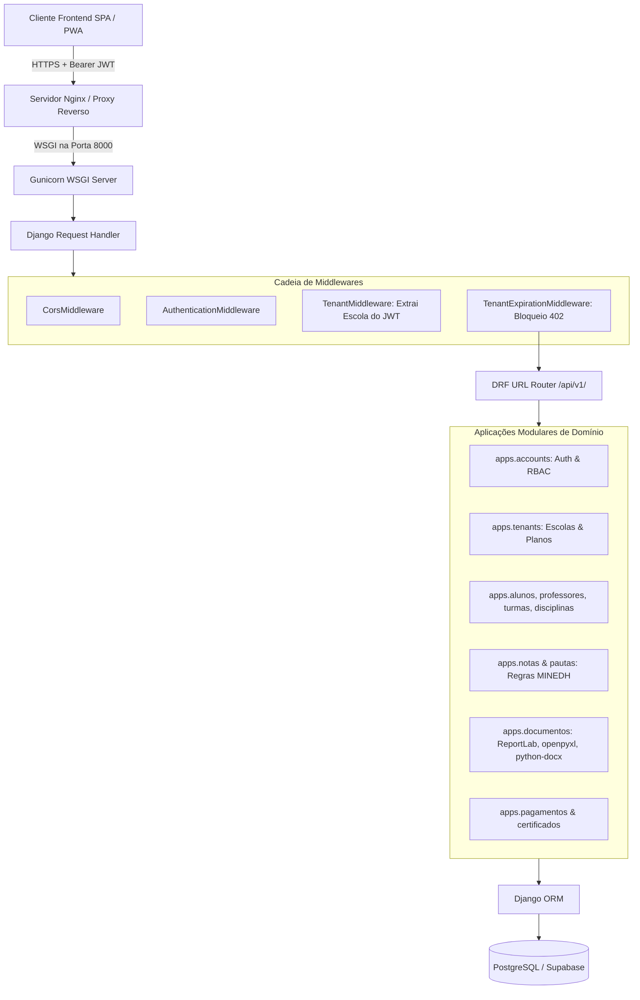

# Arquitetura do Backend — SIGE (Django REST Framework)

## 1. Visão Geral da Arquitetura
O backend do **SIGE (Sistema Integrado de Gestão Escolar)** é construído em **Python 3.12** e **Django 5.1** com **Django REST Framework (DRF)**, seguindo os princípios de alta coesão, baixo acoplamento e conformidade estrita com o padrão **RESTful**.



---

## 2. Autenticação e Segurança (JWT & RBAC)

### 2.1. Tokens JWT (SimpleJWT)
- **Access Token:** Validade de 120 minutos, emitido em `/api/v1/auth/login`. Contém claims essenciais: `user_id`, `role`, `escola_id`.
- **Refresh Token:** Validade de 7 dias, rotacionado a cada uso em `/api/v1/auth/refresh`.

### 2.2. Controle de Acesso Baseado em Papéis (RBAC)
O sistema suporta 8 papéis nominais implementados em `common.permissions.rbac`:
1. `SUPERADMIN`: Acesso global cross-tenant ao catálogo SaaS, faturamento e escolas.
2. `DIRECTOR_GERAL`: Administração executiva e acadêmica da escola.
3. `DIRECTOR_ADJUNTO_PEDAGOGICO` (DAP): Gestão de turmas, pautas, notas e validação pedagógica.
4. `SECRETARIO`: Matrículas de alunos, certidões e pagamentos.
5. `PROFESSOR`: Lançamento de notas da caderneta de turmas alocadas.
6. `ALUNO`: Consulta do seu próprio boletim e notas.
7. `ENCARREGADO`: Acompanhamento de educandos.
8. `FINANCEIRO`: Gestão de mensalidades, faturas e recibos.

---

## 3. Arquitetura SaaS Multi-Tenant

### 3.1. Resolução de Tenant em Runtime
O middleware `common.middleware.tenant.TenantMiddleware` examina o cabeçalho `Authorization: Bearer <token>`. Ao autenticar o usuário, injeta:
- `request.user`: Instância do `Usuario`.
- `request.tenant`: Instância da `Escola` do usuário autenticado.
- Caso o usuário seja `SUPERADMIN`, pode opcionalmente especificar `request.tenant` via parâmetro de busca ou cabeçalho `X-Tenant-ID`.

### 3.2. Bloqueio Automático por Inadimplência (HTTP 402)
O middleware `common.middleware.tenant_expiration.TenantExpirationMiddleware` verifica se a escola está ativa e com assinatura válida:
- Se `escola.status == 'EXPIRADA'` ou a data atual for superior à data final da assinatura, a requisição é interceptada antes de atingir as views, retornando:
  ```json
  {
    "error": "A subscrição da sua escola expirou. Por favor, renove a licença para continuar a utilizar o sistema."
  }
  ```
- **Rotas Públicas Isentas:**
  - `/health/`
  - `/api/v1/auth/*`
  - `/api/v1/saas-admin/*`
  - `/api/v1/certificados/verificar/*` (garante validação pública de autenticidade de documentos).

---

## 4. Emissão de Documentos e Mídia
- **PDF (ReportLab):** Geração programática nativa com desenho vetorial, paginação sob demanda, tabelas com colunas dinâmicas e QR Codes incorporados via `qrcode` + `Pillow`.
- **Excel (openpyxl):** Criação de planilhas formatadas conforme gabaritos oficiais com cabeçalhos institucionais.
- **Word (python-docx):** Atas de conselho de turma e relatórios acadêmicos.
