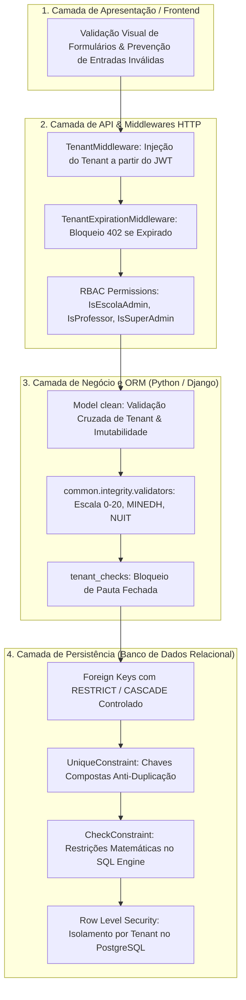
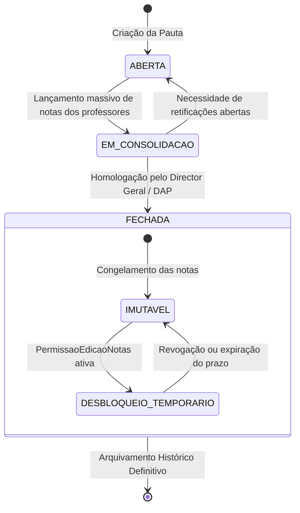

# 🛡️ Regras de Integridade do Sistema SIGE

### Plataforma SaaS Multi-Tenant de Gestão Escolar (MINEDH - Moçambique)

> **Documento Oficial de Engenharia e Conformidade Normativa**  
> **Status:** Em Vigor  
> **Camada de Implementação:** Banco de Dados (PostgreSQL / SQLite), Django ORM (`models.py`, `constraints`, `validators`, `clean()`), Middlewares e API REST.

---

## 1. Visão Geral e Princípios Fundamentais

O **SIGE (Sistema Integrado de Gestão Escolar)** processa dados acadêmicos, demográficos, financeiros e de certificação digital de múltiplas instituições de ensino independentes (Tenants). 

Para garantir a **confiabilidade jurídica dos documentos emitidos** (boletins, pautas, atas e certificados), a **imutabilidade de registros homologados** e o **isolamento hermético entre escolas concorrentes**, o sistema adota o princípio de **Defesa em Profundidade (*Defense-in-Depth*)** estruturado em **6 Pilares de Integridade**:



---

## 2. Matriz dos 6 Pilares de Integridade do SIGE

| Pilar | Dimensão | Mecanismos de Aplicação | Severidade de Violação |
| :---: | :--- | :--- | :---: |
| **I** | **Isolamento Multi-Tenant** | `escola_id` obrigatório, validação cruzada no `clean()`, RLS no Postgres, filtros automáticos no `get_queryset()` | **CRÍTICA** (Vazamento de dados) |
| **II** | **Domínio Pedagógico MINEDH** | Escala 0–20, arredondamento oficial, catálogo fechado de siglas (`NS/S/B/MB/E`, faltas $\ge 0$, períodos canônicos) | **ALTA** (Erro normativo) |
| **III** | **Entidade e Unicidade** | `UniqueConstraint` compostas (Nota por período, Pauta por turma/ano, Alocação docente, Matrícula) | **ALTA** (Duplicação / inconsistência) |
| **IV** | **Estado e Imutabilidade** | Pauta Fechada bloqueia edição de notas; exceção rastreada por `PermissaoEdicaoNotas`; recibos emitidos imutáveis | **CRÍTICA** (Fraude acadêmica) |
| **V** | **Financeira e Contratos SaaS** | `valor >= 0`, `valor_pago >= 0`, datas de assinatura coerentes (`data_fim >= data_inicio`), cotas de plano (`max_alunos`, `max_professores`) | **ALTA** (Inconsistência contábil) |
| **VI** | **Auditoria e Não-Repúdio** | Logs de acesso (`LogAcesso`), logs de impressão (`LogImpressao`), hash MD5 de documentos, QR Code com validação pública | **MÉDIA / ALTA** (Perda de rastreabilidade) |

---

## 3. Pilar I — Integridade de Isolamento Multi-Tenant

### 3.1. Regra Canônica de Particionamento Lógico
Cada registro de domínio no banco de dados deve conter uma chave estrangeira não nula para `apps.tenants.Escola` (`escola_id`), exceto o usuário `SUPERADMIN` e os `Planos` globais do SaaS.

### 3.2. Proibição de Relacionamento Cruzado (*Cross-Tenant Linkage*)
É estritamente vedado relacionar entidades de tenants distintos. Uma tentativa de associar um objeto da Escola $A$ a outro da Escola $B$ dispara imediatamente a exceção `common.integrity.exceptions.CrossTenantViolation`.

#### Matriz de Validação Cruzada:
1. **Aluno $\to$ Turma**: O `turma.escola_id` deve coincidir com `aluno.escola_id`.
2. **Nota $\to$ (Aluno, Disciplina, Turma)**:
   $$\text{nota.escola\_id} = \text{aluno.escola\_id} = \text{disciplina.escola\_id} = \text{turma.escola\_id}$$
3. **Alocação Docente $\to$ (Professor, Disciplina, Turma)**:
   $$\text{alocacao.escola\_id} = \text{professor.escola\_id} = \text{disciplina.escola\_id} = \text{turma.escola\_id}$$
4. **Pauta $\to$ Turma**: `pauta.escola_id = turma.escola_id`.
5. **Pagamento $\to$ Aluno**: `pagamento.escola_id = aluno.escola_id`.
6. **Certificado $\to$ Aluno**: `certificado.escola_id = aluno.escola_id`.
7. **Turma $\to$ Diretores**: Se informados, `director_turma.escola_id = turma.escola_id` e `director_classe.escola_id = turma.escola_id`.

---

## 4. Pilar II — Integridade de Domínio Pedagógico (Normativo MINEDH)

Todas as operações de notas, faltas e avaliações devem seguir a regulamentação do **Sistema Nacional de Educação de Moçambique**:

### 4.1. Escala Numérica de Avaliação
- **Intervalo Válido:** $0.0 \le \text{Nota} \le 20.0$.
- **Precisão:** Ponto flutuante com validação de piso e teto (`MinValueValidator(0.0)`, `MaxValueValidator(20.0)`).
- **Campos abrangidos:** `teste1`, `teste2`, `teste3`, `teste4`, `trabalho`, `avaliacao_trimestral`, `media_final`.

### 4.2. Faltas Acumuladas
- **Intervalo Válido:** $\text{Faltas} \in \mathbb{N}_0$ ($\text{faltas} \ge 0$).
- Faltas negativas são rejeitadas por `CheckConstraint` e `validar_faltas()`.

### 4.3. Períodos Acadêmicos Canônicos
Apenas os seguintes identificadores de período são aceitos pelo sistema:
- `1_TRIMESTRE`: 1º Trimestre Letivo
- `2_TRIMESTRE`: 2º Trimestre Letivo
- `3_TRIMESTRE`: 3º Trimestre Letivo
- `ANUAL`: Consolidação Final de Pauta Anual

### 4.4. Escala Qualitativa de Comportamento
O campo `comportamento` está restrito aos 5 códigos oficiais do MINEDH:

| Sigla | Denominação | Intervalo de Média Equivalente |
| :---: | :--- | :---: |
| **E** | Excelente | $18.5 \le \text{Nota} \le 20.0$ |
| **MB** | Muito Bom | $16.5 \le \text{Nota} < 18.5$ |
| **B** | Bom | $13.5 \le \text{Nota} < 16.5$ |
| **S** | Suficiente | $9.5 \le \text{Nota} < 13.5$ |
| **NS** | Não Suficiente | $0.0 \le \text{Nota} < 9.5$ |

### 4.5. Catálogo Oficial de Anotações Administrativas
O campo `anotacao` aceita apenas os códigos regulamentares:
- `D`: Dispensado
- `T`: Transferido
- `VT`: Vindo de Transferência
- `F`: Falecido
- `AM`: Anulação de Matrícula
- `PPF`: Pede Prova Final
- `PDF`: Prova de Fim de Ciclo

### 4.6. Fórmulas de Cálculo e Arredondamento
- **Média das Avaliações Contínuas (MAC):**
  $$MAC = \frac{\sum_{i=1}^{n} \text{Testes} + \text{Trabalhos}}{n}$$
- **Média Trimestral Oficial (MT):**
  $$MT = \text{round}\left(\frac{2 \times MAC + AT}{3}\right)$$
- **Aprovação Geral (1ª à 11ª Classe):** Requer $100\%$ de aproveitamento positivo ($\text{Total de Negativas} = 0$).
- **Aprovação na 12ª Classe:** Tolera no máximo 2 negativas, desde que a média geral seja $\ge 9.5$ e **nenhuma nota negativa seja inferior a 8 valores** (nota $\le 7$ acarreta Reprovação Sumária).

---

## 5. Pilar III — Integridade de Entidade e Unicidade (Constraints)

Para erradicar registros órfãos, duplicações de caderneta e colisões concorrentes, as seguintes restrições de unicidade estão ativas no banco de dados e verificadas no ORM:

```mermaid
classDiagram
    class Nota {
        +UUID escola_id
        +UUID aluno_id
        +UUID disciplina_id
        +UUID turma_id
        +String periodo
        +Float media_final
        +Int faltas
        CONSTRAINT unique_nota_aluno_disciplina_periodo
        CONSTRAINT check_nota_media_final_range
        CONSTRAINT check_nota_faltas_positivas
    }

    class Pauta {
        +UUID escola_id
        +UUID turma_id
        +String ano_letivo
        +String periodo
        +String status
        CONSTRAINT unique_pauta_turma_ano_periodo
    }

    class AlocacaoDocente {
        +UUID escola_id
        +UUID professor_id
        +UUID disciplina_id
        +UUID turma_id
        CONSTRAINT unique_alocacao_docente_disciplina_turma
    }

    class Turma {
        +UUID escola_id
        +String nome
        +String ano_letivo
        CONSTRAINT unique_turma_escola_nome_ano_letivo
    }

    class Disciplina {
        +UUID escola_id
        +String codigo
        +String ano_letivo
        CONSTRAINT unique_disciplina_escola_codigo_ano_letivo
    }

    class Pagamento {
        +UUID escola_id
        +UUID aluno_id
        +Decimal valor
        +Decimal valor_pago
        CONSTRAINT check_pagamento_valor_positivo
        CONSTRAINT check_pagamento_valor_pago_positivo
    }

    class AssinaturaEscola {
        +UUID escola_id
        +DateTime data_inicio
        +DateTime data_fim
        +Decimal valor
        CONSTRAINT check_assinatura_datas_coerentes
        CONSTRAINT check_assinatura_valor_positivo
    }

    class Plano {
        +Decimal preco
        +Int max_alunos
        +Int max_professores
        CONSTRAINT check_plano_preco_positivo
        CONSTRAINT check_plano_max_alunos_positivo
        CONSTRAINT check_plano_max_professores_positivo
    }
```



### 5.1. Tabela Detalhada de Restrições

| Entidade | Nome da Constraint | Tipo | Expressão / Campos |
| :--- | :--- | :---: | :--- |
| **Nota** | `unique_nota_aluno_disciplina_periodo` | `UNIQUE` | `(escola, aluno, disciplina, turma, periodo)` |
| **Nota** | `check_nota_media_final_range` | `CHECK` | `media_final >= 0.0 AND media_final <= 20.0` |
| **Nota** | `check_nota_faltas_positivas` | `CHECK` | `faltas >= 0` |
| **Pauta** | `unique_pauta_turma_ano_periodo` | `UNIQUE` | `(escola, turma, ano_letivo, periodo)` |
| **Alocação Docente** | `unique_alocacao_docente_disciplina_turma` | `UNIQUE` | `(escola, professor, disciplina, turma)` |
| **Turma** | `unique_turma_escola_nome_ano_letivo` | `UNIQUE` | `(escola, nome, ano_letivo)` |
| **Disciplina** | `unique_disciplina_escola_codigo_ano_letivo` | `UNIQUE` | `(escola, codigo, ano_letivo)` |
| **Aluno** | `unique_aluno_matricula` | `UNIQUE` | `matricula` |
| **Escola** | `unique_escola_nif_cnpj` | `UNIQUE` | `nif_cnpj` |
| **Escola** | `unique_escola_email` | `UNIQUE` | `email` |
| **Certificado** | `unique_certificado_codigo_autenticidade`| `UNIQUE` | `codigo_autenticidade` |
| **Pagamento** | `check_pagamento_valor_positivo` | `CHECK` | `valor >= 0` |
| **Pagamento** | `check_pagamento_valor_pago_positivo` | `CHECK` | `valor_pago >= 0` |
| **Assinatura** | `check_assinatura_datas_coerentes` | `CHECK` | `data_fim >= data_inicio` |
| **Assinatura** | `check_assinatura_valor_positivo` | `CHECK` | `valor >= 0` |
| **Plano** | `check_plano_preco_positivo` | `CHECK` | `preco >= 0` |
| **Plano** | `check_plano_max_alunos_positivo` | `CHECK` | `max_alunos >= 1` |
| **Plano** | `check_plano_max_professores_positivo` | `CHECK` | `max_professores >= 1` |

---

## 6. Pilar IV — Integridade de Estado, Imutabilidade e Ciclo de Vida

### 6.1. Máquina de Estados da Pauta Oficial



### 6.2. Regra de Imutabilidade Pós-Homologação
1. Ao atingir o status `FECHADA`, a Pauta torna-se um **instrumento jurídico de fé pública**.
2. O método `clean()` e `save()` de `Nota` intercepta qualquer tentativa de gravação (`INSERT`, `UPDATE`, `DELETE`) para aquela turma e período.
3. Se a pauta estiver fechada e não existir um registro correspondente em `PermissaoEdicaoNotas` com `ativa=True`, a operação é cancelada e levanta `ImmutableRecordViolation`.
4. **Desbloqueio Controlado**:
   - Apenas usuários com perfil `ADMIN_ESCOLA`, `DIRECTOR_ESCOLA` ou `DAP` podem conceder permissão em `/api/v1/notas/autorizacoes-edicao/`.
   - A permissão exige: `professor_id`, `turma_id`, `disciplina_id`, `periodo`, `autorizado_por` e `motivo` formal.

### 6.3. Imutabilidade Documental e Financeira
- **Recibos de Pagamento:** Uma vez atribuído o número do recibo (`recibo_numero`) e `status='PAGO'`, o valor pago e a data de liquidação tornam-se inalteráveis. Anulações exigem estorno explícito e lançamento de auditoria.
- **Certificados Digitais:** Uma vez emitidos, o `codigo_autenticidade` e o `qrcode_data` gerados são selados e não admitem retificação em linha, devendo ser revogados ou substituídos por nova via com histórico.

---

## 7. Pilar V — Integridade Financeira e Gestão de Planos SaaS

### 7.1. Validação de Cotas Contratadas
Antes de criar novas contas de alunos ou alocar novos professores, o sistema verifica a aderência ao plano da escola:
$$\text{count}(\text{Alunos Ativos}) \le \text{plano.max\_alunos}$$
$$\text{count}(\text{Professores Ativos}) \le \text{plano.max\_professores}$$

### 7.2. Bloqueio Automático por Inadimplência (HTTP 402)
- **Job Cron Diário:** Executa diariamente às 00:00 (`0 0 * * *`), verificando assinaturas onde `data_fim < agora()`.
- **Middleware `TenantExpirationMiddleware`:** Intercepta requisições não públicas de escolas expiradas ou bloqueadas manualmente, retornando código `HTTP 402 (Payment Required)`.
- **Rotas Isentas de Bloqueio:**
  - Autenticação e Renovação (`/api/v1/auth/*`, `/api/v1/saas-admin/*`)
  - Verificação Pública de Certificados (`/api/v1/certificados/verificar/*`)
  - Monitoramento de Saúde (`/health/`)

---

## 8. Pilar VI — Integridade de Auditoria, Segurança e Rastreabilidade

### 8.1. Auditoria de Sessões e Acesso (`LogAcesso`)
Cada evento de login, logout e tentativa de invasão ou credencial incorreta registra:
- `usuario_id` e `escola_id`
- Endereço IP do requisitante
- User-Agent completo
- Tipo de evento (`LOGIN_SUCESSO`, `LOGIN_FALHA`, `LOGOUT`, `BLOQUEIO_TENANT`)
- Carimbo de data/hora (`created_at`)

### 8.2. Rastreabilidade de Impressão e Documentos Oficiais (`LogImpressao`)
Toda emissão de pauta, boletim de notas, caderneta ou certificado arquiva uma trilha documental:
- Operador responsável pela emissão
- Tipologia do documento
- JSON estruturado com os dados exatos consolidados no instante da impressão
- Assinatura hash MD5 (`DocumentoSalvo.hash_md5`) para averiguação contra adulterações físicas.

---

## 9. Como Executar os Testes Automatizados de Integridade

O SIGE dispõe de uma suíte especializada de testes de integridade em `backend/tests/test_integrity_rules.py`.

```bash
# Ativar o ambiente virtual:
source venv/bin/activate  # Linux/macOS
.\venv\Scripts\activate   # Windows

# Executar os testes de integridade:
pytest tests/test_integrity_rules.py -v

# Executar a suíte completa de testes:
pytest
```

---

## 10. Atualização e Sincronização Contínua da Documentação

Sempre que uma nova entidade, chave ou restrição for introduzida no modelo de dados, execute o script centralizado para sincronizar os esquemas e documentações:

```bash
python scripts/update_docs.py
```
*O repositório já conta com ganchos de integração contínua (GitHub Actions) que validam a integridade e sincronismo deste catálogo em cada pull request.*
