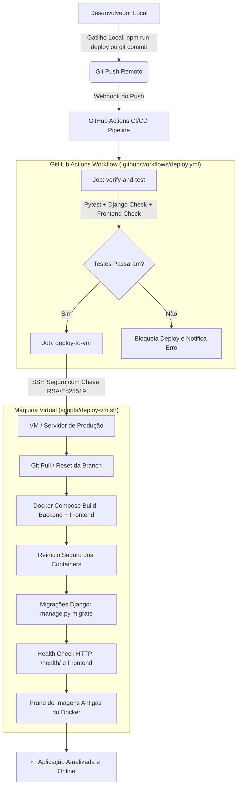

# 🚀 Guia de Deploy Automático e Gatilhos — SIGE

Este documento descreve a arquitetura, configuração e operação do **Gatilho de Git Push e Deploy Automático** do **SIGE (Sistema Integrado de Gestão Escolar)** para Máquinas Virtuais (VMs Linux / VPS na Nuvem).

---

## 📐 1. Arquitetura da Solução

O fluxo de automação conecta o desenvolvimento local à produção na VM através de uma esteira segura e idempotente:



---

## ⚡ 2. Os 4 Modos de Acionamento do Gatilho

O sistema oferece flexibilidade para desenvolvedores trabalharem de acordo com seu fluxo preferido:

| Modo | Comando | Como Funciona |
| :--- | :--- | :--- |
| **1. Push Tradicional** | `git push origin main` | Qualquer push na branch `main` dispara o workflow do GitHub Actions e o deploy na VM. |
| **2. Gatilho Local CLI** | `npm run deploy` ou `.\scripts\trigger_push_deploy.ps1` | Verifica mudanças locais, faz commit interativo (ou mensagem padrão), executa push e exibe o link do deploy. |
| **3. Gatilho via Git Hook** | `git commit -m "..."` *(após instalar hooks)* | O hook `post-commit` detecta o commit e executa o `git push` automaticamente, disparando o deploy. |
| **4. Gatilho Manual** | GitHub Web UI (`Actions` > `Run workflow`) | Permite disparar o deploy a partir de qualquer branch sem necessidade de commits novos. |

---

## 🔑 3. Configuração dos Segredos no GitHub (GitHub Secrets)

Para que a automação no GitHub Actions consiga acessar a VM via SSH de forma segura, cadastre as seguintes variáveis em:  
**Seu Repositório no GitHub** ➔ **Settings** ➔ **Secrets and variables** ➔ **Actions** ➔ **New repository secret**:

| Nome do Segredo | Descrição | Exemplo |
| :--- | :--- | :--- |
| `VM_HOST` | Endereço IP público ou domínio da VM | `198.51.100.42` ou `vm.sige.mz` |
| `VM_USER` | Usuário com permissão SSH e Docker na VM | `ubuntu`, `debian` ou `sige` |
| `VM_SSH_KEY` | Conteúdo da **chave privada SSH** | Conteúdo de `~/.ssh/id_ed25519` ou `~/.ssh/id_rsa` |
| `VM_SSH_PORT` | Porta do serviço SSH da VM *(opcional, default 22)* | `22` ou `2222` |
| `VM_DEPLOY_PATH` | Diretório onde o SIGE está clonado na VM | `/var/www/sige` ou `/opt/sige` |
| `VM_PASSPHRASE` | Senha da chave privada *(caso tenha passphrase)* | *(Opcional)* |

---

## 🖥️ 4. Preparação Inicial da Máquina Virtual (VM)

Execute estes passos na sua VM Linux (Ubuntu 22.04 / 24.04 LTS recomendado) antes do primeiro deploy:

### Passo 1: Instalar Docker e Git na VM
```bash
# Atualizar repositórios
sudo apt update && sudo apt upgrade -y

# Instalar dependências básicas
sudo apt install -y git curl ufw

# Instalar Docker Engine e Docker Compose Plugin
curl -fsSL https://get.docker.com -o get-docker.sh
sudo sh get-docker.sh

# Adicionar seu usuário ao grupo docker (evita sudo no deploy)
sudo usermod -aG docker $USER
newgrp docker
```

### Passo 2: Configurar o Diretório da Aplicação e Clonar o Repositório
```bash
# Criar diretório padrão de deploy
sudo mkdir -p /var/www/sige
sudo chown -R $USER:$USER /var/www/sige

# Clonar o repositório oficial
git clone https://github.com/mandamulefernandojose18-max/SIGE-Sistema-Integrado-de-Gest-o-Escolar.git /var/www/sige

# Entrar no diretório e conceder permissão de execução aos scripts
cd /var/www/sige
chmod +x scripts/deploy-vm.sh
```

### Passo 3: Configurar os Arquivos de Ambiente (.env) na VM
```bash
cd /var/www/sige

# Criar .env raiz
cp .env.example .env

# Criar .env do backend
cp backend/.env.example backend/.env

# Configure suas credenciais de produção no .env e backend/.env:
nano backend/.env
```

### Passo 4: Gerar Chave SSH para a Esteira do GitHub
Se você ainda não tem um par de chaves dedicado para a automação:
```bash
# Na VM ou na sua máquina local:
ssh-keygen -t ed25519 -C "github-actions-deploy-sige" -f ~/.ssh/sige_deploy

# Adicionar a chave pública no authorized_keys da VM:
cat ~/.ssh/sige_deploy.pub >> ~/.ssh/authorized_keys
chmod 600 ~/.ssh/authorized_keys

# Copie o conteúdo da chave privada para o segredo VM_SSH_KEY no GitHub:
cat ~/.ssh/sige_deploy
```

---

## 🛠️ 5. Como Usar os Gatilhos no Dia a Dia

### Modo A: Usando o Script de Gatilho Unificado (Recomendado)

No Windows (PowerShell):
```powershell
# Executa checagem, commit com mensagem, push e dispara o deploy
.\scripts\trigger_push_deploy.ps1 -Message "feat: adicionar novo relatório de notas"

# Ou simplesmente via atalho npm:
npm run deploy
```

No Linux / macOS (Bash):
```bash
# Executa o gatilho via bash
bash scripts/trigger_push_deploy.sh "feat: correcao de bug no frontend"

# Ou via atalho npm:
npm run deploy:sh
```

### Modo B: Instalar Git Hook para Gatilho Automático em Cada Commit

Se você deseja que **todo commit dispare o push e o deploy automaticamente**:
```powershell
# Instala os hooks pre-push (validação) e post-commit (auto-push)
npm run deploy:hooks

# Ou via Python diretamente:
.\backend\venv\Scripts\python.exe scripts/install_deploy_hooks.py --all
```
Após instalado:
1. Você faz `git commit -m "ajuste na tela de turmas"`.
2. O hook `post-commit` executa imediatamente `git push origin <branch>`.
3. O GitHub Actions recebe o push e inicia o deploy na VM.

Para desinstalar os hooks automáticos:
```bash
.\backend\venv\Scripts\python.exe scripts/install_deploy_hooks.py --uninstall
```

---

## 🔍 6. Diagnóstico, Logs e Health Check na VM

### Testar o Script de Deploy Diretamente na VM
Você pode testar a automação a qualquer momento conectando na VM e rodando:
```bash
cd /var/www/sige
./scripts/deploy-vm.sh main
```

### Monitorar Logs dos Containers
```bash
cd /var/www/sige

# Logs em tempo real de todos os serviços
docker compose logs -f

# Apenas do Backend Django
docker compose logs -f backend

# Apenas do Frontend SPA (Nginx)
docker compose logs -f frontend
```

### Validar Saúde dos Endpoints
```bash
# Health check do backend (deve retornar {"status":"ok"})
curl http://localhost:8000/health/

# Health check do frontend
curl -I http://localhost:5173/
```

---

## 🛡️ 7. Rollback Imediato em Caso de Emergência

Caso um deploy apresente comportamento imprevisto, reverta instantaneamente para a versão estável anterior:

```bash
# Na VM:
cd /var/www/sige
git checkout <COMMIT_ANTERIOR_HASH>
docker compose up -d --build backend frontend
```
Ou acione o workflow manual no GitHub Actions informando a tag ou hash de commit estável anterior.
