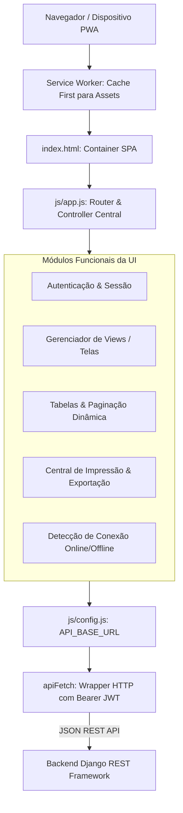

# Arquitetura do Frontend — SIGE (SPA Vanilla + PWA)

## 1. Visão Geral da Arquitetura
O frontend do **SIGE (Sistema Integrado de Gestão Escolar)** foi concebido como uma **Single-Page Application (SPA)** autónoma, leve e de alta performance, sem dependência de frameworks pesados no bundle final (React, Angular ou Vue).

Utiliza:
- **Linguagem Base:** JavaScript Moderno (Vanilla ES6+);
- **Layout & Estilos:** HTML5 semântico, Bootstrap 5 e CSS3 personalizado;
- **Progressive Web App (PWA):** `manifest.json` e `service-worker.js` com suporte a instalação e cache offline de ativos estáticos;
- **Comunicação RESTful:** Chamadas assíncronas via `fetch` nativo encapsuladas no módulo central `apiFetch`.



---

## 2. Roteamento e Ciclo de Vida da Aplicação (Client-Side Router)

O sistema de navegação baseia-se na troca dinâmica de visibilidade de secções (`<section id="view-...">`) no DOM, gerenciado pela função de roteamento em `js/app.js`:

1. **Troca de Rota (`navigateTo(viewId)`):**
   - Esconde a tela anterior com classe `d-none`.
   - Remove o active link do menu lateral / barra de navegação.
   - Remove a classe `d-none` da seção de destino.
   - Dispara a função controladora associada (ex: `carregarTurmas()`, `carregarAlunos()`, etc.).
   - Atualiza a barra de navegação ativa e o título do documento.

2. **Gestão de Sessão e Tokens:**
   - O **Access Token JWT** e os dados do usuário autenticado são armazenados no `localStorage`.
   - Toda requisição via `apiFetch` anexa automaticamente o cabeçalho:
     ```http
     Authorization: Bearer <access_token>
     ```
   - Em caso de resposta `HTTP 401 Unauthorized`, o sistema tenta renovar o token via `/api/v1/auth/refresh` ou redireciona para a tela de login.

---

## 3. Tratamento de Inadimplência e Bloqueio (HTTP 402)

Quando uma escola possui assinatura expirada, qualquer requisição de escrita ou leitura a endpoints acadêmicos protegidos retorna o código `HTTP 402 Payment Required`.

O frontend possui um interceptor global em `apiFetch` que:
1. Detecta o status `402`;
2. Bloqueia ações de formulário;
3. Exibe um modal/alerta visual amigável informando:
   > *"A subscrição da sua escola expirou. Por favor, contacte a administração ou regularize o plano de licença para continuar a emitir pautas e lançar notas."*

---

## 4. Estratégia Offline & PWA

- **Manifest (`manifest.json`):** Permite a instalação do SIGE na área de trabalho ou ecrã inicial do smartphone/tablet como aplicativo nativo.
- **Service Worker (`service-worker.js`):**
  - Faz cache dos assets imutáveis (CSS, JS, ícones, brasão da República de Moçambique).
  - Garante carregamento instantâneo mesmo em redes instáveis ou lentas nas escolas provinciais.
